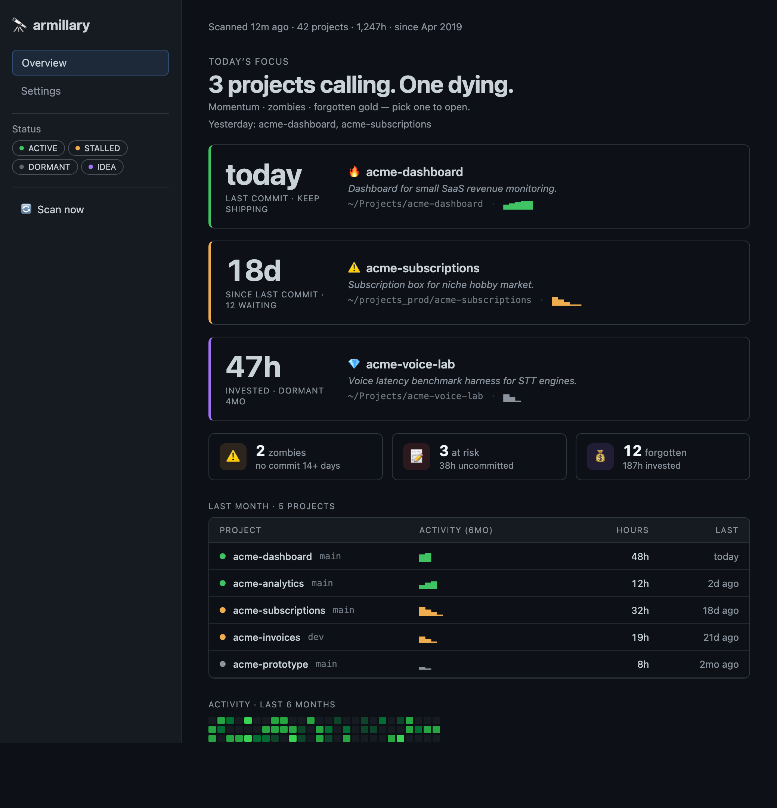
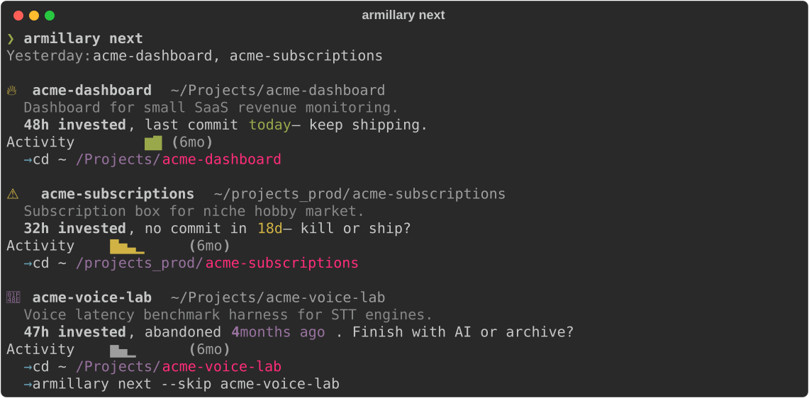
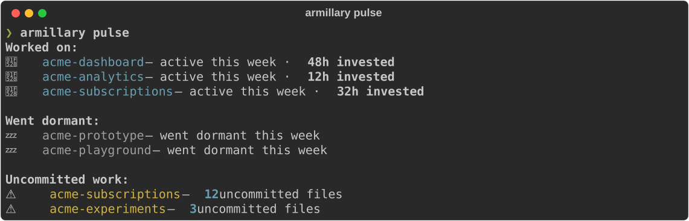
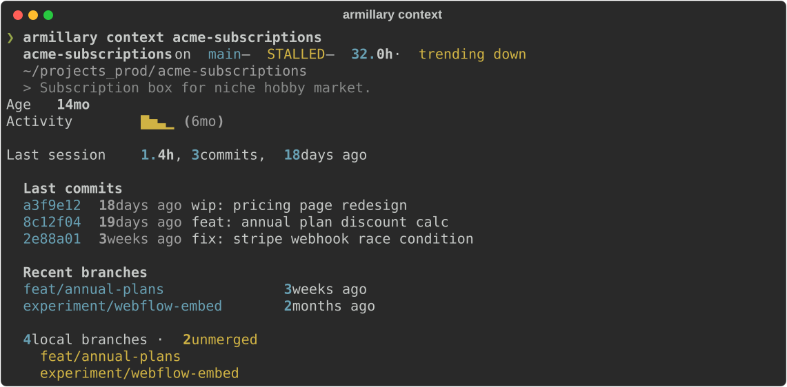

# armillary

> 💎 Never forget a side project again. Scans your folders, tells you what's rotting, and which forgotten hours are worth reviving.
>
> *An armillary sphere is an ancient astronomical instrument — concentric rings modeling the celestial sphere, with a fixed center and orbits turning around it. You are the center, your projects orbit around you, and `armillary` lets you see the whole system at once.*

```text
   50-200 projects over years                    What armillary gives you
   ─────────────────────────                     ────────────────────────

   ~/Projects/                                   🧭  armillary next
     acme-dashboard/                                  "what should I work on today?"
     acme-voice-lab/    ┌───────────────────┐
     acme-prototype/    │                   │    🔄  armillary context <name>
                        │     armillary     │        "where was I on this project?"
   ~/projects_prod/     │                   │
     acme-subscriptions/─▶│  scan + index +   │──▶ 🔍  armillary search "needle"
     acme-side-project/ │   SQLite cache    │        ripgrep across all repos
                        │                   │
   ~/code/              └───────────────────┘    🤖  MCP server
     acme-experiments/            │                   Claude Code / Cursor query your repos
     ...                        │
                                ▼                📋  armillary list
                     status: ACTIVE / STALLED /      terminal table, sortable
                             DORMANT / IDEA
                                                 🩺  armillary pulse
                                                     weekly changes across your portfolio
```

**Status:** Alpha. Daily-driver-ready on macOS / Linux.

## See it in action

`armillary start` — the dashboard:

<p><a href="#see-it-in-action"></a></p>

`armillary next` — what should I work on today?

<p><a href="#see-it-in-action"></a></p>

`armillary pulse` — weekly check-in:

<p><a href="#see-it-in-action"></a></p>

`armillary context <name>` — instant re-entry:

<p><a href="#see-it-in-action"></a></p>

Your AI coding agent sees the same data through MCP — ask Claude Code _"what should I work on?"_ and it calls `armillary_next` under the hood.

## What is this?

`armillary` is **total recall for prolific builders** — solo developers and creators who accumulate dozens to hundreds of projects over years. Not a dashboard for 5 active projects — a **memory layer** for your entire codebase history.

The daily loop:

```
armillary next      → "what should I work on?"
armillary context   → "where was I on this project?"
armillary search    → "where is this code across all my repos?"
```

Your AI coding agent (Claude Code, Cursor) gets the same data automatically via MCP — no extra commands needed.

### Features

- **Auto-discovers** every project in your umbrella folders (git repos + idea folders)
- **Tracks metadata** — status, branch, commits, work hours, dirty files, README, ADRs, notes
- **Recommends** what to work on — momentum, zombies, forgotten gold (`next`)
- **Restores context** — branch, dirty files, recent commits in sub-second (`context`)
- **Weekly pulse** — what changed, what went dormant, what's waiting (`pulse`)
- **Activity heatmap** — 12-month contribution view, exportable as a shareable HTML card (`card`)
- **Searches** across ALL projects with ripgrep
- **Revive** — keeps AI agents oriented in long Claude Code sessions via `context-revive` briefs, with scaffold + copy-prompt actions in the dashboard detail page; `armillary_revive` MCP tool also pulls up to three quoted code blocks from your other repos so the agent can reuse what you've already written (requires the `revive` CLI on PATH)
- **MCP server** — your AI agent knows your full project history
- **Launches** projects into Cursor, VS Code, Zed, Claude Code, terminal, Finder

## Non-goals

`armillary` is **not**:

- A git GUI — use Sourcetree / Fork for that
- An IDE — Claude Code / Cursor / Zed already cover that
- A monitoring tool — use UptimeRobot / Sentry for that
- A cloud service — everything stays local, offline-first

## Prerequisites

- **Python 3.11+** (managed by `uv`)
- **Git** — armillary reads repo metadata through GitPython
- **ripgrep** — the search backend (`brew install ripgrep`)

## Installation

Not yet published to PyPI. To run from source:

```bash
git clone git@github.com:justi/armillary.git
cd armillary
uv sync
.venv/bin/armillary --help
```

## Quick start

```bash
# 1. First-run setup: scans ~/ for umbrella folders, runs initial scan,
#    detects Claude Code, configures MCP server.
armillary config --init

# 2. What should I work on today?
armillary next

# 3. Where was I on this project?
armillary context my-project

# 4. Browse — dashboard auto-scans on start.
armillary start
```

## Commands

| Command | What it does |
|---|---|
| `armillary next` | What should I work on today? Momentum, zombies, forgotten gold |
| `armillary context <name>` | Where was I? Branch, dirty files, recent commits — sub-second |
| `armillary pulse` | Weekly pulse — what you worked on, what went dormant, what's waiting |
| `armillary search "<query>"` | ripgrep across all projects |
| `armillary list` | Rich terminal table with `--status`, `--type`, `--umbrella` filters |
| `armillary open <name>` | Launch project in configured editor (`--target cursor`/`vscode`/`zed`) |
| `armillary archive <name>` / `activate <name>` | Mark project done / restore to automatic status |
| `armillary exclude <name>` / `include <name>` | Hide / unhide a project across all armillary output |
| `armillary purpose <name>` | Set or show a project's one-line purpose |
| `armillary share` / `card` | Generate shareable tweet / heatmap HTML card |
| `armillary config --init` | First-run setup: umbrella picker → scan → Claude Code bridge → MCP |
| `armillary scan` | Full scan of all umbrellas, persist to cache |
| `armillary start` | Incremental scan + Streamlit dashboard |
| `armillary install-claude-bridge` | Write compact `~/.claude/armillary/repos-index.md` |
| `armillary mcp-serve` | MCP server (stdio) for AI coding agents |

## MCP server for AI coding agents

armillary exposes seven MCP tools that Claude Code / Cursor can call:

| Tool | What it does | Speed |
|---|---|---|
| `armillary_next` | What should I work on today? | instant |
| `armillary_context` | Where was I? Branch, dirty files, recent commits | sub-second |
| `armillary_search` | Exact code search: function names, imports, error messages | <10ms |
| `armillary_projects` | List all projects with path, status, description | instant |
| `armillary_pulse` | What changed in my portfolio this week? | instant |
| `armillary_steal` | Reusable 40-line blocks ranked across all your repos | <100ms |
| `armillary_revive` | Project brief plus up to 3 quoted blocks from other repos | sub-second |

`armillary config --init` auto-configures MCP in `~/.claude/mcp.json`. Or manually:

```json
{
  "mcpServers": {
    "armillary": {
      "command": "/path/to/venv/bin/armillary",
      "args": ["mcp-serve"]
    }
  }
}
```

For details on the transport, lifecycle, cache-staleness semantics, and
how to debug tool calls, see [`docs/mcp.md`](docs/mcp.md).

### `armillary_revive` — revive with receipts

Vanilla `revive show` (from the `context-revive` CLI) tells the agent
what the project is. `armillary_revive` adds the second half of the
question: *what did I already write that solves the same thing
elsewhere?*

**What it returns:** the vanilla revive brief verbatim, followed by a
`STEAL_HITS` markdown section with up to three quoted code blocks
ranked across your *other* indexed repositories. Each block carries
its source project, file path, line range, and detected symbol. When
no other repo matches the project name, the section is omitted
entirely — the brief comes back unchanged.

```text
<vanilla revive show output>

## STEAL_HITS — code you wrote in other repos

- other-project/src/handler.py:42-81 — handle_event
  ```py
  def handle_event(payload):
      ...
  ```
```

**When to call it:** at the start of a session in a project the agent
hasn't seen before, especially after a long break. The cross-repo
quotes are most valuable for projects whose name token shows up in
sibling repos (test files referencing it, integration specs, a fork,
documentation that names it). For tool-style projects whose name
appears nowhere else, the section will be empty — that's expected,
not a bug.

**Requirements:**

- The `revive` CLI on `PATH` (`pipx install context-revive`).
- A `.revive/static.md` in the target project — bootstrap once with
  `revive init`, then fill it via the suggest prompt from the dashboard.
- An armillary scan that has populated the code index
  (`armillary scan` or the dashboard "Scan now" button) — without it,
  `STEAL_HITS` falls back to brief-only.

**Failure modes (graceful):**

- `revive` binary missing → returns a one-line `revive failed: …`
  string instead of crashing the agent's tool call.
- Code index missing or built without FTS5 → returns the vanilla
  brief with no `STEAL_HITS` section.
- Output over the shared MCP response budget → trimmed with a
  `[truncated to fit response budget]` marker.

## Privacy

`armillary` **never sends data off-device**. Project index, metadata, cache, and config all live on your local disk.

- No telemetry, no analytics, no external calls
- All documentation uses symbolic placeholders, never real paths

## Development

```bash
uv sync --extra dev

# 450+ tests covering scanner / metadata / status / cache / config /
# launcher / search / exporter / bootstrap / CLI / MCP / next / context /
# pulse / share / heatmap / transitions / purpose / revenue / revive
.venv/bin/python -m pytest

# lint + format
.venv/bin/ruff check .
.venv/bin/ruff format --check .
```

CI runs pytest + ruff on Python 3.11 and 3.12.

## Architecture

Key design decisions:

- **Three-interface model** — MCP (primary, invisible) > CLI (daily decisions) > Dashboard (companion)
- **Thin Streamlit UI** — presentation only, logic in importable services
- **Incremental scan** — mtime compare, 1–2s vs 20+s full scan
- **SQLite cache** — drop and rebuild, no migrations (`PRAGMA user_version`)
- **Sub-second context** — all git operations local, no network
- **Response safety** — 20k char cap, preview truncation, compact JSON

## License

MIT (see [LICENSE](LICENSE))
